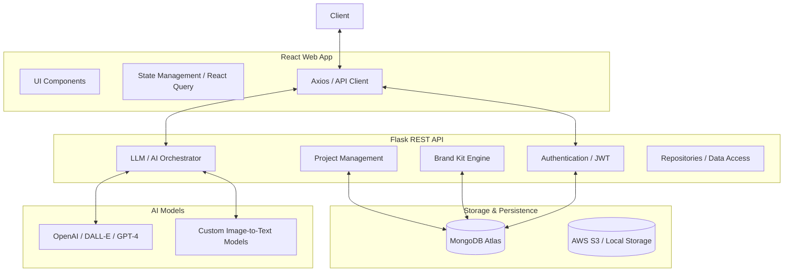

# GenMark: Full Project Blueprint

## 1. Project Overview & Vision
**GenMark** is an AI-powered generative marketing platform designed to streamline the creative workflow for marketers, designers, and businesses. By integrating advanced Text-to-Image (T2I), Image-to-Text (I2T), and Text-to-Text (T2T) models, GenMark allows users to generate, manage, and optimize marketing assets within a unified ecosystem.

The system focuses on:
- **Efficiency**: Automating repetitive content generation tasks.
- **Brand Consistency**: Ensuring AI-generated outputs align with predefined brand guidelines.
- **Unified Management**: Centralizing campaigns, assets, and analytics.

---

## 2. System Architecture

GenMark follows a **Service-Oriented Architecture (SOA)** with clear separation between the UI, Business Logic, and AI Inference layers.

---

## 3. Core Modules & Features

### 3.1. Authentication & Security
- **JWT-Based Auth**: Secure login and registration using JSON Web Tokens.
- **Role-Based Access Control (RBAC)**: Supports roles like `admin`, `manager`, and `user`.
- **Identity Middleware**: Custom decorators for protecting routes and verifying user identity.

### 3.2. Project Management
- **Workspace Organization**: Users can create multiple projects to categorize campaigns.
- **Artifact Cataloging**: Every generated image or text is linked to a specific project.
- **Dashboard Integrations**: Real-time stats on project activities and asset counts.

### 3.3. Brand Intelligence
- **Brand Kits**: Centralized storage of logos, hex color palettes, and typography.
- **Prompt Injection**: The AI Orchestrator automatically injects brand guidelines into model prompts.
- **Consistency Guardrails**: Ensures that generated visuals use the specified brand colors.

### 3.4. AI Content Generation
- **Text-to-Image (T2I)**: Powered by DALL-E 3 with custom style injection.
- **Image-to-Text (I2T)**: Extraction of captions and SEO metadata from uploaded visuals.
- **Text-to-Text (T2T)**: Generates social media posts, ad copies, and blog drafts.

---

## 4. Database Schema (MongoDB)

### Users Collection
- `_id`: ObjectId
- `name`: string
- `email`: string (unique index)
- `password_hash`: string (bcrypt)
- `role`: enum (`admin`, `manager`, `user`)
- `created_at`: timestamp

### Projects Collection
- `_id`: ObjectId
- `user_id`: ObjectId (ref: Users)
- `name`: string
- `description`: string
- `created_at`: timestamp

### BrandKits Collection
- `_id`: ObjectId
- `project_id`: ObjectId (ref: Projects)
- `name`: string
- `logo_url`: string
- `colors`: array of strings (HEX)
- `fonts`: array of strings
- `guidelines`: string (markdown)

### MarketingContent Collection (Assets)
- `_id`: ObjectId
- `project_id`: ObjectId (ref: Projects)
- `type`: enum (`image`, `text`)
- `content_url`: string (S3 link)
- `text_content`: string
- `metadata`: object (dimensions, prompt, model)
- `status`: enum (`pending`, `completed`, `failed`)

---

## 5. Technical Stack

### Frontend
- **Framework**: React 18+ (Vite)
- **Styling**: Tailwind CSS & Radix UI (Sleek, modern UI)
- **State management**: React Query (TanStack) for sync/cache.
- **Animations**: Framer Motion for premium interactions.

### Backend
- **Core**: Python (Flask)
- **Authentication**: Flask-JWT-Extended
- **Database Driver**: PyMongo / MongoEngine
- **AI Backend**: OpenAI SDK Integration
- **Infrastructure**: Docker & Docker-Compose

---

## 6. Implementation Status (Roadmap)

| Feature | Status | Details |
| :--- | :--- | :--- |
| **Auth System** | ✅ Completed | Login, Signup, JWT, RBAC. |
| **Dashboard** | ✅ Completed | Metrics, Recent Activity. |
| **Project CRUD** | ✅ Completed | Create, List, Delete projects. |
| **Brand Kit** | ✅ Completed | Color/Font storage and retrieval. |
| **AI Generation** | ⚠️ Partial | Mock / Demo mode active; API keys needed for production. |
| **Asset Library** | ✅ Completed | Searchable storage of generated content. |
| **Advanced Editor** | 📅 Backlog | Integrated visual editor for fine-tuning. |
| **Collaboration** | 📅 Backlog | Multi-user project sharing. |

---

## 7. Infrastructure & Security
- **Dockerization**: The entire stack is containerized for consistent development environments.
- **Environment Management**: Separation of development and production secrets via `.env`.
- **CORS Policies**: Restricted API access to trusted frontend origins.
