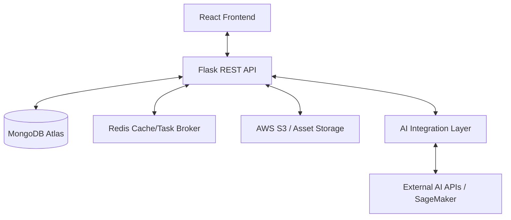

# GenMark Backend Technical Blueprint

This blueprint provides a detailed technical specification for the GenMark backend, derived from the Software Requirements Specification (SRS). It serves as the architectural foundation for implementation.

## 1. System Architecture

GenMark follows a **Service-Oriented Architecture (SOA)** with a clear separation between the UI, Business Logic, and AI Inference layers.



---

## 2. API Specification (RESTful)

### Authentication Module (`/api/auth`)
| Endpoint | Method | Description | Payload |
| :--- | :--- | :--- | :--- |
| `/signup` | POST | Register new user | `{name, email, password}` |
| `/login` | POST | Authenticate & get JWT | `{email, password}` |
| `/logout` | POST | Invalidate session | `N/A` |
| `/me` | GET | Get current user profile | `N/A` |

### Project Management (`/api/projects`)
| Endpoint | Method | Description | Payload |
| :--- | :--- | :--- | :--- |
| `/` | GET | List all user projects | `N/A` |
| `/` | POST | Create a new project | `{name, description}` |
| `/<id>` | GET | Get project details | `N/A` |
| `/<id>` | PUT | Update project info | `{name, description}` |
| `/<id>` | DELETE| Remove project & assets | `N/A` |

### Brand Kit Management (`/api/brand-kits`)
| Endpoint | Method | Description | Payload |
| :--- | :--- | :--- | :--- |
| `/<project_id>` | GET | Get brand kit for project | `N/A` |
| `/<project_id>` | POST | Create/Update brand kit | `{logo_url, colors[], fonts[]}` |

### AI Content Generation (`/api/generate`)
| Endpoint | Method | Description | Payload |
| :--- | :--- | :--- | :--- |
| `/t2i` | POST | Text-to-Image Generation | `{prompt, project_id, style_preset}` |
| `/i2t` | POST | Image-to-Text Analysis | `{image_url / file, project_id}` |

### Asset Library (`/api/assets`)
| Endpoint | Method | Description | Payload |
| :--- | :--- | :--- | :--- |
| `/<project_id>` | GET | List project assets | `N/A` |
| `/<id>` | DELETE| Delete specific asset | `N/A` |

---

## 3. Database Schema (MongoDB)

### Users Collection
```json
{
  "_id": "ObjectId",
  "name": "string",
  "email": "string (unique)",
  "password_hash": "string (bcrypt)",
  "role": "enum (admin, manager, user)",
  "created_at": "timestamp"
}
```

### Projects Collection
```json
{
  "_id": "ObjectId",
  "user_id": "ObjectId (ref: Users)",
  "name": "string",
  "description": "string",
  "created_at": "timestamp"
}
```

### BrandKits Collection
```json
{
  "_id": "ObjectId",
  "project_id": "ObjectId (unique, ref: Projects)",
  "logo_url": "string (S3 link)",
  "colors": ["string (hex)"],
  "fonts": ["string"],
  "design_guidelines": "markdown/string",
  "updated_at": "timestamp"
}
```

### Assets Collection
```json
{
  "_id": "ObjectId",
  "project_id": "ObjectId (ref: Projects)",
  "type": "enum (image, text)",
  "url": "string (S3 link)",
  "prompt_used": "string",
  "metadata": {
    "dimensions": "string",
    "model_version": "string"
  },
  "created_at": "timestamp"
}
```

---

## 4. AI Integration Workflow

### Text-to-Image (T2I) Pipeline
1.  **Request received**: Prompt + Project ID.
2.  **Context Injection**: Fetch `BrandKit` for the project. Append brand colors/styles to the user prompt (e.g., "In the style of [Brand Colors]").
3.  **AI Call**: Send enriched prompt to Model API (Stable Diffusion / DALL-E).
4.  **Post-processing**: Upload generated image to S3.
5.  **Persistence**: Save asset metadata to `Assets` collection.
6.  **Response**: Return S3 URL to frontend.

---

## 5. Security & Middleware
- **JWT Authorization**: Custom decorator `@token_required` to check `Authorization: Bearer <token>` on all private routes.
- **Role-Based Access (RBAC)**: Middleware to verify if `user.role` has permission for specific actions (e.g., Only `admin` can view global analytics).
- **CORS Handling**: Restricted to trusted frontend domains in production.
- **Input Validation**: Use `Pydantic` or `Marshmallow` to sanitize API inputs.

## 6. Implementation Checklist
- [ ] Initialize Flask-JWT-Extended for secure auth.
- [ ] Set up MongoDB schemas using PyMongo or MongoEngine.
- [ ] Implement S3 upload utility for asset handling.
- [ ] Create Background Task worker (Celery/Redis) for AI calls.
- [ ] Build the Prompt Engineering service for Brand Kit injection.
